# Assignment 3: Parametric Structural Canopy Documentation

## Table of Contents

- [Pseudo-Code](#pseudo-code)
- [Technical Explanation](#technical-explanation)
- [Design Variations](#design-variations)
- [Challenges and Solutions](#challenges-and-solutions)
- [References](#references)

---

## Pseudo-Code

1. **Main Function: Generating the Canopy**

   - **Inputs**:
     - `base_surface`: The initial surface for the canopy.
     - `depth_divisions`: number of divisions along the surface
     - `depth_map_control`: Control parameter for depth variation.
     - `variant_type`: Parameter for the type of modification applied to the surface
     - `recursion_params`: Parameters for recursive supports.
     - `tessellation_strategy`: Strategy for surface tessellation.
     - `mesh_refinement`: Parameter for amount of mesh cells generated
     - `support_points`: Points where supports will be generated.

   - **Process**:
     - **Control surface type**
       - Check if the surface is recognized as intended by the script 
     - **Generate Depth Map**:
       - Modify `base_surface` using a control functions. Choices have been set to a standard sine/cosine mix, a ripple like effect function and a standard roof like effect.
    - **Generate Surface points**:
       - Based on `modified_surface` generates point at a parametrically chosen amount of subdivisions of the surface.
    - **Generate Depth map**:
       - Generates a `depth_map` based of the `modified_surface`. Resolution of the image can be chosen parametrically in the script 
     - **Tessellate Surface**:
       - Divide the modified surface into panels. Choices have been added to utilize Quadratic, triangular and hexagonal elements. Added an additional function to extract the edges of the mesh to see if meshing to occuring as intended.
     - **Generate Vertical Supports**:
       - Create supports using recursive geometry.
    - **Connect Supports and Surface**:
       - (NOT SUCCESFULLY IMPLEMENTED) Have the last set of branches connect to points along the `modified_surface` or `canopy_mesh`.

   - **Outputs**:
     - `modified surface`: The canopy `base_surface` modified by chosen function
     - `canopy_mesh`: The tessellated canopy shell, based on the chosen tessellation strategy.
     - `canopy_edges`: The edges of each mesh cell based on the chosen tessellation strategy.
     - `supports`: The vertical support structures.
     - `support_points`: The points from which the supports originate.
     - `surface_points`: Points along the `modified_surface`

2. **Functions**
   - **`ensure_surface(geometry)`**
     - *Purpose*: Ensure that the input surface is treated as a rg.surface, not a GUID or Berp.
     - *Implementation Details*:
       - Uses `rs.coercegeometry()` to transform the input geometry (surface) to a rg.surface or Berp.
       - Checks what type of surface resulted from `rs.coercegeometry()`. Skips if the geometry is a `rg.surface.`. If the surface is instead a Berp it extracts the underlying geometry if the surface only has one face. Raises an error if the Berp has more than one face.

   - **`generate_depth_map(surface, control_value, variation_type)`**
     - *Purpose*: Modify the input surface to create depth variations based off of mathematical funtions.
     - *Implementation Details*:
       - Subdivides the input surface based off of how many `depth_divisions` have been requested and creates a list of points.
       - Depending on the selected `variation_type` modify the surface with a specific mathematical function.
          - if `variation_type="Sine"` the surface will be modified according to the function `sin(x*PI*2)*cos(y*PI*2)`. Which modifies the surface in standard sine/cosine waves.
          - if `variation_type="Ripple"` the surface will be modified according to the function `sin(10 * (x^2 + y^2)) / 10`. Which modifies the surface to give a Ripple like effect.
          - if `variation_type="Roof"` the surface will be modified to vary linearly towards the midpoint of the surface from the edges to give a Roof like effect.
       - All of these mathematical functions have a parameter `control_volume` added to them to choose the intensity the function has to the surface.
       - The function will add the newly calculated value of z (In a x,y,z point) to specific point values along the surface based off of the chosen `variation_type`, which will be added to a list of points called `modified_points`.
       - Finally the function will generated the modified surface based off of the `modified_points` and the `depth_divisons`.

    - **`generate_surface_points(surface)`**
        - *Purpose*: Generates points from input surface for connection between surface and supports
        - *Implementation Details*:
          - Subdivides the input surface based off of how many `depth_divisions` have been requested and creates a list of points.
          - use GHPython to visualise the list of points.

    - **`generate_depth_map_image(surface, u_divisions, v_divisions, colormap')`**
        - *Purpose*: Generates a depth map image using NumPY based off of a input surface in a chosen matplotlib color scheme.
        - *Implementation Details*:
          - Subdivides the input surface based off of how many `u- or v_divisions` have been requested and creates a list of z-values.
          - Convert the z-values into a `np.array` and normalize the z-values.
          - color the z_values according to the normalized values and the chosen colormap.
          - generate an image from the values and colormap.

   - **`tessellate_surface(surface, strategy)`**
     - *Purpose*: Tessellate the surface based on the chosen strategy. Choices have added for quadratic, triangular or hexagonal elements.
     - *Implementation Details*:
       - Subdivides the input surface based on the refinement of the mesh requested, `mesh_refinement`.
       - Meshes the surface based on the requested tessellation type.
         - if **quadratic elements** are requested the function will generate coordinate values along the u and v plane and generate four points per `mesh_refinement` and add vertices between the perpendicular and paralell points. Then it will create a face from the vertices.
         - if **triangular elements** are requested the function will simillarly generate vertices from points and create a face from them
         - if **hexagonal elements** are requested the function will calculate the center of a hexagonal cell based off of the `mesh_refinement`. Then generate vertices from 6 points around the center. Then it will create a face from these 6 vertices.
     
   - **`extract_mesh_edges(mesh)`**
      - *Purpose*: Extract the edges of each mesh cell to see if the mesh is being generated correctly.
      - *Implementation Details*:
        - Checks if the mesh is made from triangular or qudaratic faces.  
        - Draws a line with rg.LineCurve() along each vertex and adds them to a list.  

   - **`generate_recursive_supports(start_point, params, depth)`**
     - *Purpose*: Generate branching structures for supports.
     - *Implementation Details*:
       - Uses recursive logic to generate supports from specified `support_points` to create vertical supports.
       - The recursion can be controlled with the parameters:
        - `max_depth`, this value will affect how many iterations the recursion will run over.
        - `vertical_angle`, this value affects the angle between the z-direction and x,y plane for each branch.
        - `length`, this value will affect the length of the initial branch.
        - `length_reduction` this value will affect how much each branch will be shortened by in %
        - `branches` this value affects how many branches will sprout from each recursion point
        - `angle_variation` this value will randomly be selected as either the positive and negative value of itself and will affect how the branches angle in the x,y plane.

3. **Utilization**
    - Utilize each of the defined functions to generate the desired output based on parametrically chosen inputs.

---

## Technical Explanation

- **Depth Map Generation**
  - Surface geometry can be manipulated in three distinctly different ways.
    1. A standard Sine/Cosine waves function.
    2. A Ripple like effect that based off of sine waves.
    3. A Roof like effect that can raise or lower the center point of the surface.
  - Each of these function can be parametrically controlled by 2 values `depth_map_control` and `depth_divisions`.
  - `depth_map_control` will change the intensity of each function (I.E the size or amount of waves depending of the function).
  - `depth_divisions` will change the amount of subvisions along the input surface. 
  - Seperate functions have been added to: 
    1. Add points along the surface to connect the supports to the surface.
    2. Generate a depth map image based off the surface. 

- **Surface Tessellation**
  - Once the surface geometry has been modified to the desired shape it can be tessellated into three different types.
    1. Quadratic elements
    2. Triangular elements
    3. Hexagonal elements
  - Each of these tessellation methods can be chosen to depending on the surface to give the best approximation of the geometry of the surface.
  - This apporximations gives us subdivisions of the surface we can use differently depending on the desired effect of the structure. I.E Places for glass panes of the structure and different colored glass panes combination possibilities and more.
  - Once the Tessellation has been completed another function has been added to visualise the geometry of each mesh cell to see if the mesh is generated as intended.

- **Recursive Supports Generation**
  - The supports will recursively sprout from a predefined list of starting points.
  - The recursion can be controlled with the parameters:
        1. `max_depth`, this value will affect how many iterations the recursion will run over.
        2. `vertical_angle`, this value affects the angle between the z-direction and x,y plane for each branch.
        3. `length`, this value will affect the length of the initial branch.
        4. `length_reduction` this value will affect how much each branch will be shortened by in %
        5. `branches` this value affects how many branches will sprout from each recursion point
        6. `angle_variation` this value will randomly be selected as either the positive and negative value of itself and will affect how the branches angle in the x,y plane.
  - Altering these paramters can visually change the supports significantly.

- **Combining Geometries** (NOT SUCCESFULLY IMPLEMENTED)
  - Based off of the points of the `modified_surface` and the final branch in the `supports`. Connect the final branches to the nearest point on the surface geometry.

---

## Design Variations

### Base Surface Shape Variations

1. **Variation 1: [Sine Canopy]**
   
   Sine Canopy
   
   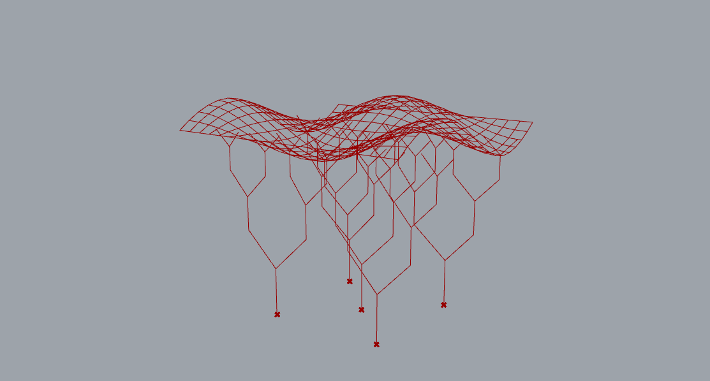
   Sine Canopy front view
   
   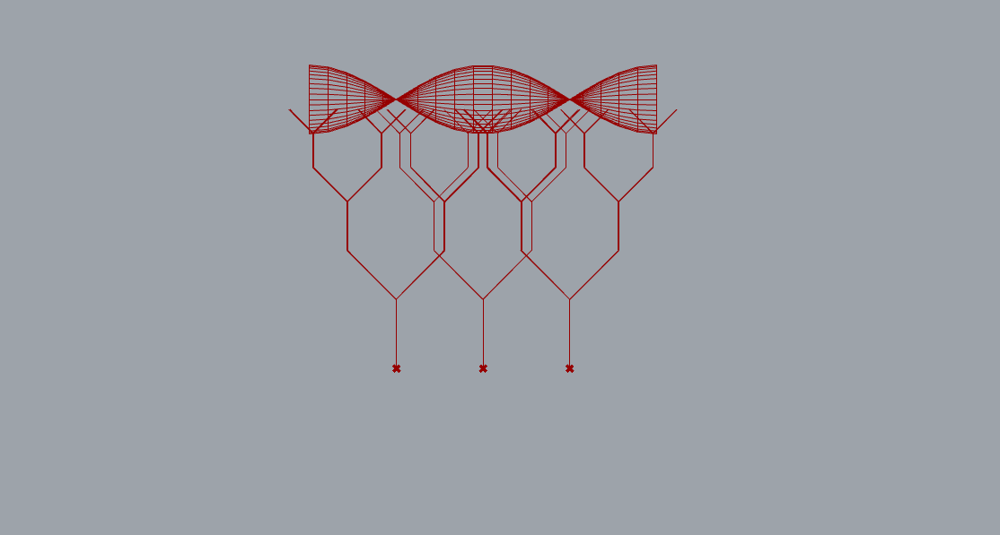
   Sine Canopy side view
   
   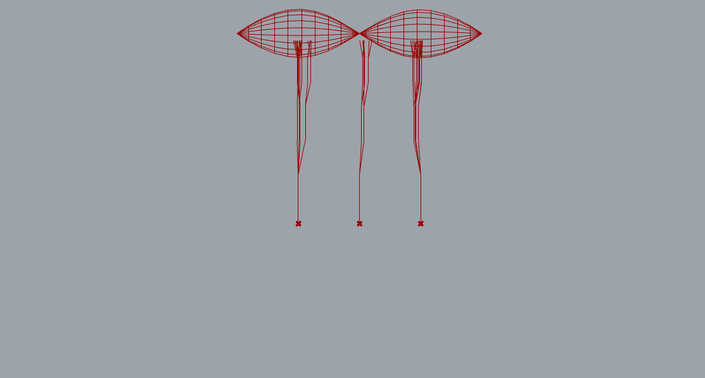
   Sine Canopy top view
   
   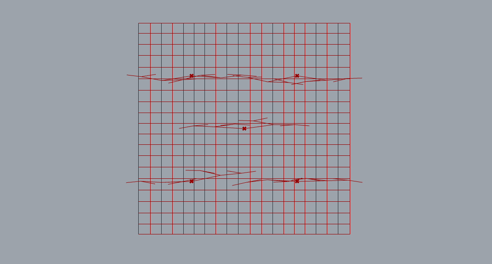
   Sine Canopy depth map
   
   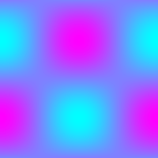

   - **Parameters**:
     - `depth_divisions`: [8]
     - `depth_map_control`: [2]
     - `variation_type`: [Sine]
     - `tessellation_strategy`: [quad]
     - `mesh_refinement`: [20]
     - `support_points`: 
       point_1 = (0,0,0)
       point_2 = (5,5,0)
       point_3 = (-5,5,0)
       point_4 = (-5,-5,0)
       point_5 = (5,-5,0)
     - `recursion_params`:
        'max_depth': 3
        'vertical_angle': 45
        'length': 4
        'length_reduction': 0.7
        'branches': 2
        'angle_variation': 15

3. **Variation 2: [Ripple Canopy]**

   Ripple Canopy
   
   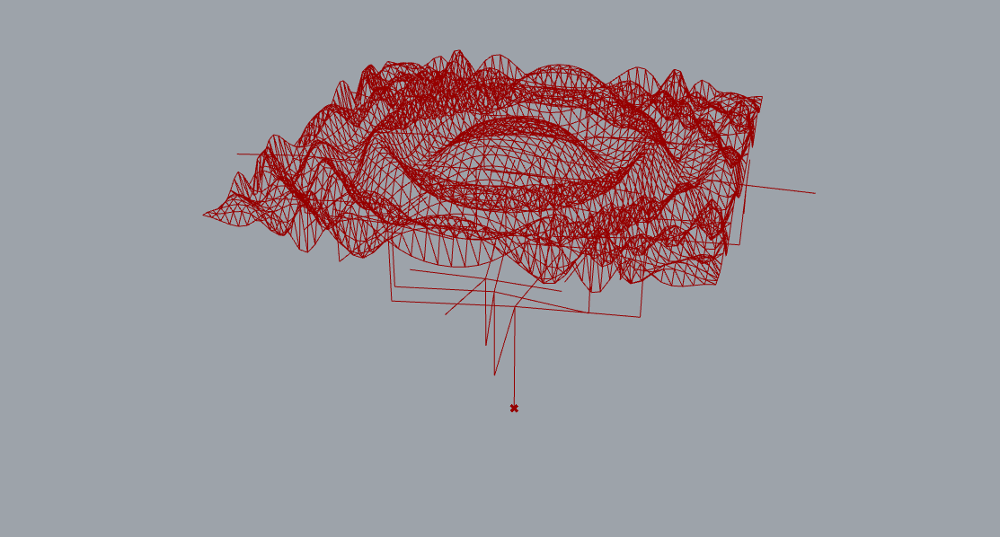
   Ripple Canopy front
   
   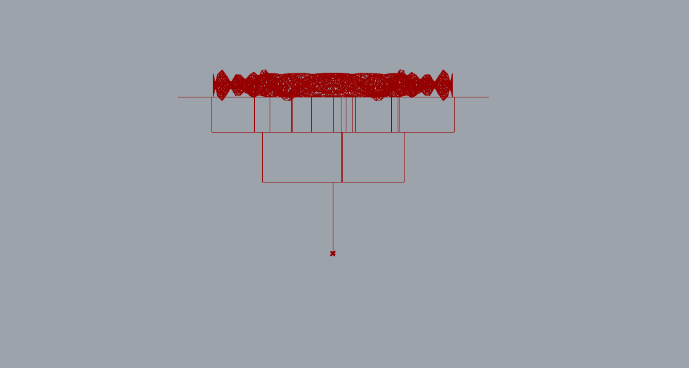
   Ripple Canopy side
   
   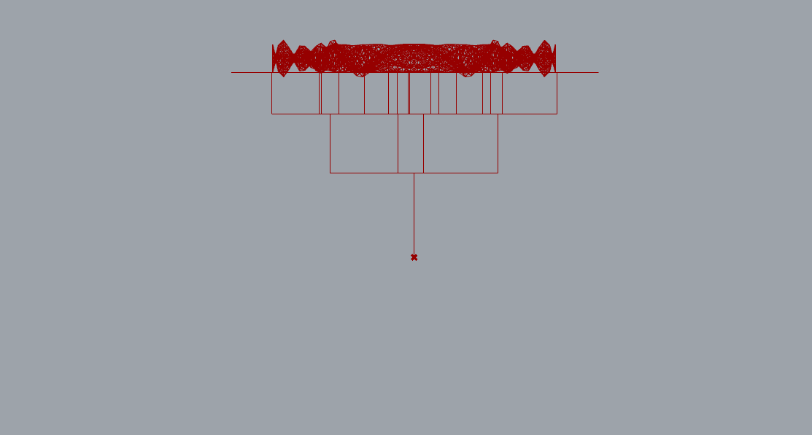
   Ripple Canopy top
   
   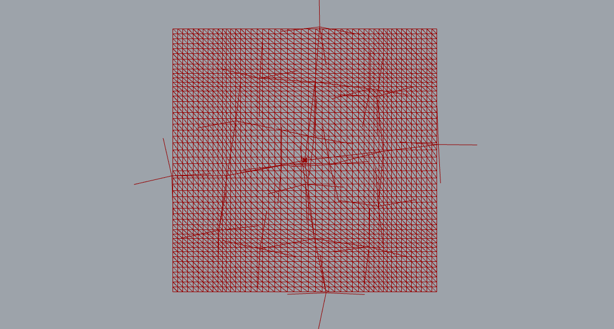
   Ripple Canopy depth map
   
   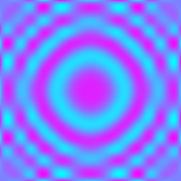
   - **Parameters**:
     - `depth_divisions`: [20]
     - `depth_map_control`: [3]
     - `variation_type`: [Ripple]
     - `tessellation_strategy`: [triangular]
     - `mesh_refinement`: [50]
     - `support_points`: 
       point_1 = (0,0,0)
     - `recursion_params`:
        'max_depth': 3
        'vertical_angle': 90
        'length': 6
        'length_reduction': 0.7
        'branches': 4
        'angle_variation': 15

4. **Variation 3: [Roof Canopy]**

   Roof Canopy
   
   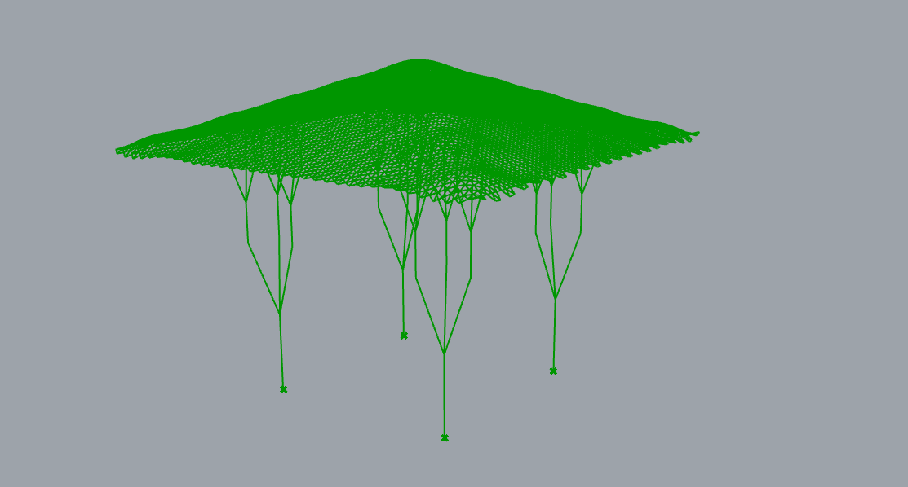
   Roof Canopy front
   
   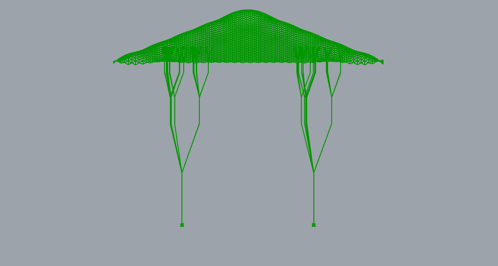
   Roof Canopy side
   
   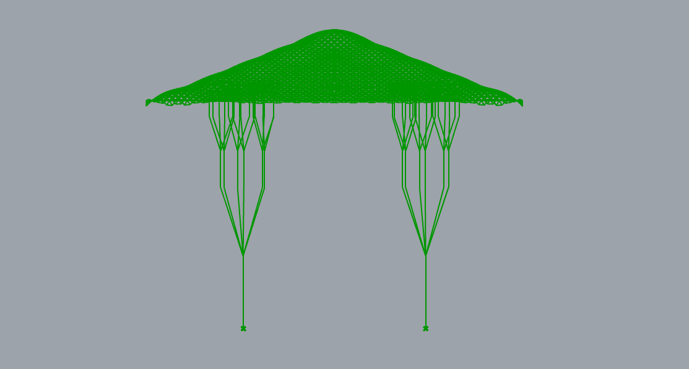
   Roof Canopy top
   
   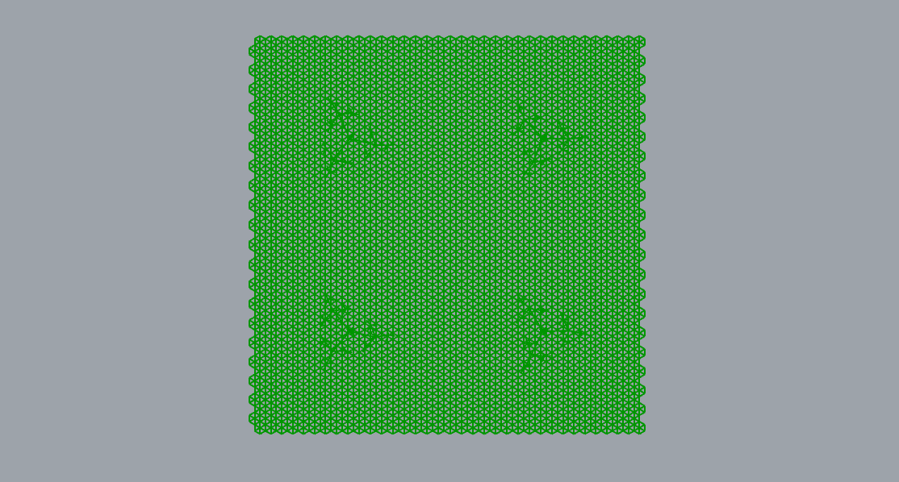
   Roof Canopy depth map
   
   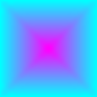
   - **Parameters**:
     - `depth_divisions`: [12]
     - `depth_map_control`: [8]
     - `variation_type`: [Roof]
     - `tessellation_strategy`: [hexagonal]
     - `mesh_refinement`: [30]
     - `support_points`: 
       point_1 = (5,5,0)
       point_2 = (-5,5,0)
       point_3 = (-5,-5,0)
       point_4 = (5,-5,0)
     - `recursion_params`:
        'max_depth': 3
        'vertical_angle': 20
        'length': 4
        'length_reduction': 0.5
        'branches': 3
        'angle_variation': 15

---

## Challenges and Solutions

*(Discuss any challenges you faced during the assignment and how you overcame them.)*

### Examples:

- **Challenge 1**: General structure in grasshopper.
  - **Solution**: Looked over youtube videos, lecture slides and reddit.

- **Challenge 2**: Objects not transfering as intended.
  - **Solution**: Discovered objects transfer as GUID solved differently for some of the different time it was encountered see challenge x and x, later discovered it was in the lecture slides with type hint.

- **Challenge 3**: Visual input disappears in Rhino.
  - **Solution**: Error in the code destroyed the logic but didn't result in error.

- **Challenge 4**: Surface being passed a GUID.
  - **Solution**: used `rs.coercegeometry()` to convert it into geometry again.

- **Challenge 5**: Surface being passed a Berp.
  - **Solution**: Wrote function to check if the Berp only has one face and extract it if possible.

- **Challenge 6**: Support points are being passed as a GUID.
  - **Solution**: changed type of canopy input of support_point from ghdoc object to point3d.

- **Challenge 7**: Add grasshopper parameters to easily change visual output.
  - **Solution**: Looked at slides, youtube, reddit and general experimentation in grasshopper.

- **Challenge 8**: Supports are not behaving similarly.
  - **Solution**: Never solved, rewrote recursion logic instead.

- **Challenge 9**: Mesh seems smooth even at low mesh density.
  - **Solution**: Was confusing the output mesh with the output surface.

- **Challenge 10**: Quad mesh has a diagonal, which could confuse people into thinking it is a triangular mesh.
  - **Solution**: Rewrote face generation logic of the quadratic elements, instead of adding two triangles, just add four vertices instead.

- **Challenge 11**: Supports are generated as straight lines.
  - **Solution**: Recursion logic was happening along the z-axis so any rotation did not result in visual changes.
  
- **Challenge 12**: Extracting the surface points from the depth map function without breaking the other functions.
  - **Solution**: Wrote new function to extract surface points independantly of the surface function.

- **Challenge 13**: Connecting the supports and surface.
  - **Solution**: NOT SOLVED. IDEA: Use the end point of branches to connect to surface points.

- **Challenge 13**: Add more complex tessellation.
  - **Solution**: NOT SOLVED.

---

## References

*(List any resources you used or found helpful during the assignment.)*

- **Python for CAD Applications**:
  - Rhino.Python Guides
  - RhinoScriptSyntax Documentation

- **Grasshopper and GhPython**:
  - Grasshopper Primer
  - Grasshopper youtube tutorials
  - Rhino youtube tutorials
  - pip install guide in grasshopper
  - GhPython Tutorials

- **Mathematical Functions and Recursion**:
  - Python Math Module
  - Recursion in Python Tutorials

- **General information**
- Lecture slides
- [functions] (https://www.benjoffe.com/code/tools/functions3d/examples) (function ideas)
- [chatgpt.com](https://chatgpt.com/) (general questions)
- [colormaps] (https://matplotlib.org/stable/users/explain/colors/colormaps.html)

---

